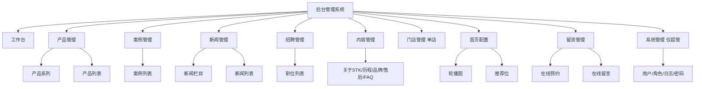

# STK本然家居 企业官网 — UI/UX 设计规范

| 文档信息 | 内容 |
|---------|------|
| 文档名称 | STK本然家居企业官网 UI/UX 设计规范 |
| 版本 | V1.0 |
| 文档状态 | V1.0（2026-08-18 初版，依据 PRD V1.7 与两份高保真原型提炼） |
| 配套文档 | `STK本然家居企业官网PRD.md`（V1.7，需求基线） |
| 原型来源 | `STK本然家居_官网原型.html`（前台）、`STK本然家居_后台管理系统原型.html`（后台） |
| 设计风格 | 极简、高级、大气（墨绿主色系） |

---

## 文档说明

### 目的与读者
本文档是 STK本然家居企业官网（前台展示系统 + 后台管理系统）的**视觉与交互落地规范**，把 PRD §13「设计规范」展开为开发、走查、测试可直接执行的设计系统。

- **前端开发**：按「设计令牌 + 组件库 + 页面级规范」实现界面。
- **后台开发**：按「后台令牌 + 组件库 + 抽屉/表格规范」实现管理界面。
- **UI 走查 / 测试**：按第 13 章「验收检查清单」核对一致性与体验。

### 与 PRD 的关系
- **PRD V1.7** 定义「做什么」（功能、数据模型、接口、验收），是需求基线。
- **本文档** 定义「做成什么样」（颜色、字体、间距、组件、交互、动效、无障碍），是视觉与体验基线。
- 两者冲突时以 PRD 功能需求为准，视觉细节以本文档为准；若发现 PRD 描述与已确认原型实现不一致，以原型实现为准并在本文档「附录 B：待规范收敛项」中标注。

### 来源标注约定
- 「原型锚点」以 `文件#L行号` 形式标注，指向原型中对应实现，便于开发定位。
- 章节末尾标注「依据」：`PRD §x.x` 表示来自需求文档；`原型` 表示来自高保真原型已实现内容。

### 技能对齐
本文档按 `ui-ux-pro-max` 技能的 8 类优先级组织覆盖：无障碍(CRITICAL)、触摸与交互(CRITICAL)、性能(HIGH)、布局与响应式(HIGH)、字体与颜色(MEDIUM)、动画(MEDIUM)、风格(MEDIUM)、图表(LOW)。

---

## 1. 设计原则与品牌调性

| 原则 | 说明 | 体现 |
|------|------|------|
| 极简 | 信息层级克制，不堆砌装饰 | 大留白、少元素、单焦点 |
| 高级 | 材质与空间质感优先 | 大图、真实场景摄影、轻阴影 |
| 大气 | 视觉张力来自留白与比例 | 全宽 Banner、≥80px 区块上下留白 |
| 品牌一致 | 墨绿主色系贯穿前后台 | 前台 `#0F3D2E`、后台侧边栏同色 |
| 内容驱动 | 展示内容由后台维护 | 文案/图片/状态均数据化 |

> 调性参考：蓝鸟家具官网的克制感，但更强调留白与现代感（PRD §13）。

---

## 2. 设计令牌 Design Tokens

设计令牌是全局唯一真值来源（single source of truth）。前台与后台分别定义，但共享同一套品牌色语义。

### 2.1 前台令牌（官网原型 · Tailwind 配置 + 全局 CSS）

**来源**：官网原型.html#L13-17（Tailwind `theme.extend.colors`）、#L20（字体栈）、#L32（body）。

| 令牌 | 值 | 语义 / 用途 |
|------|-----|------------|
| `ink` | `#0F3D2E` | 深墨绿：品牌主色、标题、导航、主按钮、正文 |
| `inklt` | `#6FA088` | 浅墨绿：点缀色、CTA 按钮、关键数字、激活态、链接 |
| `cream` | `#FAF8F5` | 米白：页面主背景、卡片底 |
| `mist` | `#F4F7F5` | 浅灰绿：次级背景、hover 底、分区底 |
| `weak` | `#9E9E9E` | 弱化灰：辅助文字、占位、禁用态 |
| `ink`/hover 派生 | `#164a38`、`#1d5240` | 按钮 hover、渐变中段 |
| 字体 | `-apple-system, BlinkMacSystemFont, "PingFang SC", "Microsoft YaHei", "Noto Sans SC", "Source Han Sans SC", sans-serif` | 中文无衬线系统栈 |
| 标题字距 | `.tracking-title{letter-spacing:.14em}`、`.tracking-sub{.06em}` | 标题/副标加宽字距 |
| 正文行高 | 1.6–1.8 | 长文可读性 |

**圆角 / 阴影 / 层级**
- 卡片圆角：`rounded-xl`(12px) / `rounded-2xl`(16px)；按钮圆角：`rounded-md`(6px) / `rounded-lg`(8px)，克制。
- 阴影：`shadow-soft` ≈ `0 2px 12px rgba(0,0,0,.06)`；hover 升为 `shadow-md`。避免重阴影。
- 浮动导航：`rounded-xl backdrop-blur-md border border-black/5 shadow-nav`（官网原型.html#L163）。
- z-index：登录遮罩 `z-100`；轮播箭头 `top-1/2 -translate-y-1/2` 浮于图上。

**渐变（Banner / 占位）**
- 占位图 `.ph`：`linear-gradient(135deg,#0F3D2E,#1d5240 45%,#6FA088)`（官网原型.html#L129）。
- 轮播渐变：`#0F3D2E→#3A5A4C→#6FA088`、`#1B4332→#2D6A4F→#95D5B2` 等墨绿系（官网原型.html#L322-337）。
- 柔占位 `.ph-soft`：`#F4F7F5→#e7efe9`；暖占位 `.ph-warm`：`#e8dfd4→#faf8f5`（官网原型.html#L130-131）。

> 依据：PRD §13.1 + 原型。

### 2.2 后台令牌（后台原型 · CSS 变量）

**来源**：后台原型.html#L9-12（:root 变量）、#L15（body）。

| 令牌 | 值 | 语义 / 用途 |
|------|-----|------------|
| `--ink` | `#0F3D2E` | 品牌主色（同前台）、主按钮、侧边栏底 |
| `--inklt` | `#6FA088` | 浅墨绿：侧边栏激活态、链接、上传激活 |
| `--cream` | `#FAF8F5` | 浅色文字（深底上） |
| `--mist` | `#F4F7F5` | 浅色底 |
| `--weak` | `#9E9E9E` | 弱化文字 |
| `--bg` | `#f0f2f5` | 内容区页面背景 |
| `--card` | `#fff` | 卡片/面板底 |
| `--border` | `#f0f0f0` | 浅边框 |
| `--border2` | `#e8e8e8` | 输入框/分隔边框 |
| `--sider` | `#0F3D2E` | 侧边栏底色（与前台品牌色呼应） |
| `--sider-hover` | `rgba(255,255,255,.08)` | 侧边栏项 hover |
| `--sider-active` | `#6FA088` | 侧边栏当前项指示 |
| 基础字号 | `14px` | AntD 默认，body `font-size:14px` |

**组件态颜色**
- 按钮：primary `#0F3D2E`(hover `#164a38`)；danger `#cf1322`（后台原型.html#L97-111）。
- 状态标签 `.tag`：`green #e8f6ef/#0F3D2E`、`blue #e6f4ff/#1677ff`、`gray #fafafa/弱`、`red #fff1f0/#cf1322`、`orange #fff7e6/#d46b08`（后台原型.html#L125-130）。
- 表格：thead `#fafafa`、th 13px/600、行 hover `#fafcff`（后台原型.html#L117-119）。
- Toast：success 点 `#52c41a`、error 点 `#cf1322`（后台原型.html#L174-175）。
- 上传激活：`border-color #6FA088 / bg #f6ffed`（后台原型.html#L1252-1254）。

> 依据：PRD §13.2 + 原型。

### 2.3 双端令牌映射对照

| 语义 | 前台 | 后台 | 一致性要求 |
|------|------|------|-----------|
| 品牌主色 | `ink #0F3D2E` | `--ink #0F3D2E` | 必须一致 |
| 点缀色 | `inklt #6FA088` | `--inklt #6FA088` | 必须一致 |
| 浅背景 | `cream/mist` | `--bg #f0f2f5 / --card #fff` | 后台用中性灰底，前台用米白底（可接受差异，均属浅色系） |
| 弱化文字 | `weak #9E9E9E` | `--weak #9E9E9E` | 必须一致 |
| 危险/删除 | 前台少用红 | `#cf1322` | 后台统一危险红 |
| 状态色 | 前台用标签/文字 | `.tag` 五色体系 | 后台状态色需收敛（见附录 B） |

---

## 3. 前台全局规范

### 3.1 栅格与容器
- 容器：`max-w-7xl`（1280px）为主，居中 `mx-auto`；文本型区块 `max-w-3/4/5xl`（官网原型.html#L302/366/375…）。
- 区块上下留白：≥80px（PRD §13.1「页面上下留白 ≥ 80px」）。
- 左右内边距：`px-4 lg:px-8`（移动端 16 / 桌面端 32）。

### 3.2 顶部导航（浮动）
- 形态：浮动胶囊 `rounded-xl backdrop-blur border-black/5 shadow-nav`，吸顶（官网原型.html#L163）。
- 主导航：首页 / 产品 / 新闻 / 招聘入口 / 关于我们 / 服务支持；当前项高亮 `text-ink font-medium`，其余 `text-weak`，hover `text-ink`（官网原型.html#L173-238）。
- 二级菜单：悬浮展开（产品→产品中心/新案例展示；新闻→企业新闻/行业资讯；招聘→社会/校园；关于我们→5 项），下拉项 hover `bg-mist`（官网原型.html#L177-238）。
- CTA：「在线预约」独立按钮 `bg-inklt text-white hover:bg-ink`（官网原型.html#L246）。
- 移动端：汉堡菜单，展开为全宽列表面板（官网原型.html#L258-282）。

### 3.3 页脚
- 内容：品牌简介、快捷导航（各栏目）、联系方式（全国客服/邮箱）、**线下门店信息（上海旗舰店 名称/地址/电话）**、动态版权 `© 当前年份 STK本然家居`（官网原型.html#L1284-1302；PRD FR-03）。
- 说明：取消「服务网点入口」，门店信息直接展示（PRD FR-53）。

### 3.4 加载与异常
- 列表/图片加载：骨架屏 `.ph` 占位（墨绿渐变块，官网原型.html#L472+）。
- 接口失败：兜底 UI（重试入口/空状态），不白屏（PRD NFR-16）。
- 404 页：统一友好提示 + 返回首页（PRD FR-06）。

### 3.5 隐私提示
- 预约/留言表单附近展示隐私提示文案（PRD §8.7 合规提示，符合《个人信息保护法》）。

> 依据：PRD §8.1(FR-01~07)、§13.1 + 原型。

---

## 4. 前台组件库

| 组件 | 规范 | 原型锚点 |
|------|------|---------|
| 按钮 Button | 主按钮 `bg-inklt text-white hover:bg-ink`（CTA）、次按钮 `bg-cream border hover:bg-white`、幽灵按钮 `border border-cream/60 text-cream`（深底上）；圆角 6–8px；transition-colors 150–200ms | 官网原型.html#L246/315-316/547-548 |
| 卡片 Card | `bg-cream rounded-xl overflow-hidden shadow-soft hover:shadow-md`；图片 `img-zoom`（hover `scale≤1.05`）；标题 `text-ink`、副信息 `text-weak` | 官网原型.html#L424-448/510-529 |
| 状态标签 Tag | 前台用文字+色块（招聘急招、FAQ 启用等）；语义色来自 `inklt`/红 | 招聘原型 see §5 |
| 表单 Form | label `text-ink`、输入 `border border-black/10 rounded-lg focus:outline-none`、必填 `*`；错误就近提示 | 官网原型.html#L1112(预约)/#1018(联系) |
| 轮播 Carousel | 全宽渐变 slide；左右箭头 `.arrow-btn`（无圆圈，仅白色箭头+投影，hover opacity .75，active scale .92）；指示点；自动播放+手动；切回首页 `reset()` 复位 | 官网原型.html#L56-61/#322-354/#1534 |
| Tab 切换 | `.tab-btn` 底部 2px 下划线，active `text-ink font-600` 下划线 `scaleX(1)`；用于新闻/招聘分类 | 官网原型.html#L64-68/#767-768/#938-939 |
| 分页 Pagination | 服务端分页，每页建议 12（产品）/ 列表默认；页码控件 | PRD FR-19 |
| 面包屑 Breadcrumb | 「← 返回 XX 列表」文字按钮 `text-weak hover:text-ink`（案例/新闻/产品/职位详情） | 官网原型.html#L714/#859/#884/#961 |
| 骨架屏 Skeleton | `.ph` 渐变块，按图片比例 `aspect-[16/10]` 等 | 官网原型.html#L472/#716/#739+ |
| 空状态 Empty | 筛选/搜索无结果友好提示 | PRD FR-21 |
| 徽标 Badge | 后台待办红角标（后台）；前台少用 | 后台原型.html#L83 |

> 依据：PRD §8 + 原型组件实现。

---

## 5. 前台页面级规范

页面路由（SPA `navigateTo`）：`home / products / cases / case-detail / news / news-detail / product-detail / jobs / job-detail / about-stk / timeline / brand / appointment / contact / policy / faq`（官网原型.html#L1515）。

| 页面 | UI 要点 | 原型锚点 |
|------|--------|---------|
| 首页 | 自上而下：轮播 Banner → 品牌标语区（Slogan+「走进 STK」）→ 企业亮点（3–4 卡片）→ 精选产品 → 精选案例 → 最新新闻 → 预约 CTA；模块顺序可后台配置（FR-08~15） | 官网原型.html#L305-548 |
| 产品中心 | 系列筛选（左/顶）+ 关键词搜索 + 产品卡片（图/名/系列/价格，无价显「价格面议」）+ 分页 + 空状态（FR-16~21） | 官网原型.html#L586(筛选)/#424-448 |
| 产品详情 | 图集主图+缩略图、基本信息、富文本描述、规格参数表、同系列推荐（FR-22~26） | 官网原型.html#L884-915 |
| 新案例 | 卡片列表（封面+标题+空间标签）+ 分页；详情：项目信息+富文本+多图集（FR-27~29） | 官网原型.html#L636-676/#716-744 |
| 新闻 | 栏目 Tab（企业新闻/行业资讯）+ 列表 + 详情（富文本，日期 YYYY.MM.DD）（FR-30~34） | 官网原型.html#L767-768/#859+ |
| 招聘 | 分类 Tab（社会/校园）+ 职位卡片（名称/地点/时间/急招）；详情含岗位职责/任职要求富文本 + **投简历表单**（FR-35~38） | 官网原型.html#L938-939/#961(详情) |
| 职位详情·投简历 | 表单：姓名*、联系电话*、邮箱、简历附件*(PDF/Word≤10MB)、自我推荐；必填校验 + 成功反馈「1–3 个工作日内联系」；提交落库（FR-37、BR-69） | PRD FR-37 |
| 关于我们 | 关于STK（富文本）、发展历程（时间轴）、品牌介绍（富文本）、在线预约、联系我们（FR-39~42） | 官网原型.html#L221-225 |
| 在线预约 | 表单：姓名*、电话*（手机号校验）、预约时间、意向产品、备注；**不含门店选择**（固定上海旗舰店）；成功提示（FR-43~46） | 官网原型.html#L1112-1140 |
| 联系我们 | 联系信息 + 地图 iframe + 留言表单（姓名*/电话*/邮箱/内容*）（FR-47~50） | 官网原型.html#L1018-1080 |
| 服务支持 | 售后政策（富文本）、FAQ（手风琴展开/收起）；门店信息展示于联系我们（FR-51~54） | 官网原型.html#L1254/1268(FAQ) |

> 依据：PRD §8 + 原型页面实现。

---

## 6. 后台布局与导航

### 6.1 整体布局
- 左侧固定侧边栏（深墨绿 `#0F3D2E`）+ 顶部栏（面包屑/用户/角色）+ 右侧内容区（`--bg` 浅灰底、白色卡片）。
- 登录页：全屏墨绿渐变遮罩（后台原型.html#L18）。

### 6.2 手风琴式二级导航（核心规范）
- 结构：父级 `.menu-parent` 含 `.menu-item`（带 `menu-arrow` ▼）+ 子项 `.menu-sub`（默认 `display:none`）（后台原型.html#L41-49）。
- 交互：点击父级 `toggle('open')`，箭头 `rotate(180deg)`；**同组仅展开当前页父级，其余自动折叠**（JS 见后台原型.html#L966-1007）。
- 子项：字号 13px、`color rgba(255,255,255,.72)`，hover `#fff`，当前项高亮（后台原型.html#L41-49）。
- 角色显隐：`.role-only-admin` 组（系统管理）仅超级管理员可见（后台原型.html#L308）。

> 依据：PRD §7.2、§13.2 + 后台原型.html#L233-313/#966-1007。

---

## 7. 后台组件库

| 组件 | 规范 | 原型锚点 |
|------|------|---------|
| 表格 Table | `.table` 12 列栅格感；thead `#fafafa`、th 13px/600/nowrap；行 hover `#fafcff`；缩略图 `.thumb`（墨绿渐变方块 46px） | 后台原型.html#L117-122/#121 |
| 操作列 | `.table-actions`（flex, gap6, nowrap, 同行水平排列）：编辑 / 删除 同排（后台原型.html#L113） | 后台原型.html#L520-522/#658-661 |
| 状态标签 Tag | `.tag` 圆角 5px、nowrap；五色：green 启用/招聘中/已发布/已到店/已处理；red 待处理/已关闭/已淘汰；orange 已联系；blue 角色(超管)；gray 停用/草稿 | 后台原型.html#L125-130/#658-697 |
| 按钮 Button | primary `#0F3D2E`(hover `#164a38`)、danger `#cf1322`、link `hover #164a38`、行内 `btn-act`/`btn-act-del`（26px 高，hover 浅红底） | 后台原型.html#L97-111 |
| 抽屉 Drawer | `openDrawer(id,title)` 右侧滑出，承载编辑/详情（产品/案例/新闻/招聘/内容/门店/轮播/预约/留言/用户）；富文本字段用 `<textarea>` 并回填当前值 | 后台原型.html#L1161-1254 |
| 弹窗 Modal | `openModal(id,title)`；确认删除 `modal width:400px` + 二次确认「此操作不可撤销」（后台原型.html#L1535-1539） | 后台原型.html#L1535 |
| 表单 Form | `.form-item label` + `.in`（input/select，圆角 7px，border `#e8e8e8`）+ 必填 `*` 红色；textarea `min-height:72px resize:vertical` | 后台原型.html#L161-164/#1098-1254 |
| 上传 Upload | 虚线框 `.upload`（`border dashed #e8e8e8`，hover 绿边绿底），点击触发文件选择 | 后台原型.html#L164/#1212/#1252 |
| 搜索/筛选条 | `.field label + .in`（关键词搜索、状态/分类筛选），实时 `searchTable()` | 后台原型.html#L377/#399/#461/#651 |
| Toast | 右上角，`toast('success'|'error', msg)`，圆点绿/红 | 后台原型.html#L174-175 |
| 分页 Pagination | 列表分页（与前台一致口径） | PRD BR-68 |
| 徽标 Badge | 待办红色角标 `.badge-red`（待处理预约/留言数） | 后台原型.html#L83 |

> 依据：PRD §9.12(BR-65~68) + 原型组件实现。

---

## 8. 后台页面级规范

| 模块 | UI 要点 | 原型锚点 |
|------|--------|---------|
| 工作台 | 数据概览卡片（产品/案例/新闻/职位数）+ 待办提醒（红角标）（BR-07/08）；⚠️ 图标当前用 emoji，需替换 SVG（见附录 B） | 后台原型.html#L345-360 |
| 产品管理 | 系列列表 + 产品列表；编辑 Drawer（系列/名称/价格/图集/描述/参数/推荐）；上下架一键 | 后台原型.html#L399-414/#1161 |
| 案例管理 | 列表（封面/标题/空间标签/状态）+ 编辑 Drawer（多图/项目信息/富文本） | 后台原型.html#L427-436/#1173 |
| 新闻管理 | 栏目 + 文章列表；编辑 Drawer（富文本正文） | 后台原型.html#L461-470/#1183 |
| 招聘管理 | 职位列表 + 编辑 Drawer（地点默认上海/急招/富文本）+ **简历投递列表**（BR-69~72） | 后台原型.html#L485-492/#1189 |
| 内容管理 | 关于STK/品牌/售后（富文本 textarea）、历程（年份时间轴）、FAQ（手风琴）、联系信息 | 后台原型.html#L516-522 |
| 门店管理 | 单店（上海旗舰店）编辑，无新增/删除/城市筛选（BR-43~46） | 后台原型.html#L1205-1208 |
| 首页配置 | 轮播管理（1920×800 图）、推荐位/品牌标语（sys_config） | 后台原型.html#L1212 |
| 留资管理 | 预约/留言列表（状态标签）+ 详情 Drawer + 状态流转 + 导出 | 后台原型.html#L651-681 |
| 系统管理 | 用户/角色/日志/密码（仅超管；`.role-only-admin` 显隐） | 后台原型.html#L308/#694-697 |

> 依据：PRD §9 + 原型页面实现。

---

## 9. 交互与动效

| 维度 | 规范 | 原型锚点 |
|------|------|---------|
| 过渡时长 | 微交互 150–300ms（`transition-colors`/`.15s`/`.2s`）；不超过 500ms | 前台#L315/后台#L97-111 |
| Hover 反馈 | 颜色/透明度/轻阴影变化；**禁止导致布局位移的 scale 缩放**（仅图片 `img-zoom≤1.05`、箭头 `active scale .92`） | 前台#L40/后台#L60-61 |
| 焦点态 | 输入框 `focus:outline-none` 改为可见焦点环（见 §11 无障碍） | 前台#L586 |
| 轮播 | 自动播放 + 手动；切回首页 `window._carousel.reset()`（停播/索引归位/指示点复位/重启）解决加载不出问题 | 前台#L1534 |
| 加载态 | 骨架屏 `.ph` 占位；异步按钮禁用防重复点击（预约提交） | 前台#L472/后台 |
| 抽屉/弹窗 | 右侧滑入 Drawer；Modal 居中；确认类用二次确认 | 后台#L1535 |
|  prefers-reduced-motion | 尊重系统设置，关闭自动轮播与非必要动画 | PRD/技能动画优先级 |

> 依据：PRD §13.1(动效) + 技能「动画」优先级 + 原型。

---

## 10. 响应式与多端适配

| 断点 | 规则 | 原型锚点 |
|------|------|---------|
| 桌面 ≥1024 | 完整导航 + 二级下拉；`max-w-7xl` 容器 | 前台#L163/#177-238 |
| 平板 768–1024 | 导航可折叠；栅格降列 | PRD NFR-14 |
| 移动 <768 | 汉堡菜单全宽面板；单列卡片；`px-4`；按钮 `sm:inline-flex` 显示 | 前台#L258-282/#246 |
| 容器 | 统一 `max-w-7xl`，避免混用宽度 | 前台#全页 |
| 无横向滚动 | 内容适配视口；触控目标 ≥44px（按钮/导航项） | 技能「布局与响应式」 |
| 字体 | 移动端正文 ≥16px（前台用 `text-sm` 处需校验，后台 14px 为管理后台可接受） | 技能「可读字号」 |

> 依据：PRD §8.1(FR-04)、§12.3(NFR-14) + 技能「布局与响应式」+ 原型。

---

## 11. 无障碍与合规

按技能「无障碍(CRITICAL)」优先级落实：

| 项 | 规范 | 现状 / 原型锚点 |
|----|------|---------------|
| 对比度 | 正文与背景 ≥4.5:1；弱化文字 `#9E9E9E` 仅用于辅助，不用于正文主信息 | 墨绿 `#0F3D2E` on 米白 `#FAF8F5` 达标 |
| 焦点环 | 所有交互元素可见 focus 态（当前输入框 `focus:outline-none` 需补可见环） | 前台#L586 待补 |
| alt 文本 | 所有内容图片配描述性 alt | 走查项 |
| aria-label | 纯图标按钮（轮播箭头、Logo）加 aria-label | 前台#L166/#351-354 已加 |
| 键盘导航 | Tab 顺序 = 视觉顺序；可聚焦元素可键盘操作 | 走查项 |
| 表单 label | 输入框配 `<label for>` 或关联文本 | 前台表单/后台`.form-item label` |
| 隐私合规 | 预约/留言表单展示隐私提示（最小化收集） | PRD §8.7 合规提示 |

> 依据：PRD NFR-15 + 技能「无障碍」+ 原型。

---

## 12. 图标与视觉资源

| 项 | 规范 | 说明 |
|----|------|------|
| 图标集 | 统一 SVG 图标（Lucide / Heroicons，24×24 viewBox，固定尺寸） | 禁止 emoji 当 UI 图标（技能规则） |
| ⚠️ 后台 emoji | 工作台图标当前用 📝💬 emoji → 替换为 SVG | 后台原型.html#L351/#356（见附录 B） |
| 品牌 Logo | 文字标「STK本然家居」为主，避免猜测 logo 路径 | 前台#L166 |
| 图片风格 | 大图、真实场景摄影；产品图统一浅底棚拍感 | PRD §13.1 |
| 占位图 | `.ph` 墨绿渐变块（按比例），上线前替换真实素材 | 前台#L129-131 |
| 上传规范 | 类型 jpg/png/webp、单图 ≤5MB、随机文件名 | PRD BR-19/NFR-09 |

> 依据：PRD §13 + 技能「图标与视觉元素」+ 原型。

---

## 13. 验收检查清单

### 13.1 视觉一致性
- [ ] 前后台主色均为 `#0F3D2E`、点缀 `#6FA088`、弱化 `#9E9E9E`
- [ ] 前台背景米白系、后台内容区中性灰底，均属浅色系
- [ ] 卡片圆角 8–12px、按钮 4–8px、阴影轻（无重阴影）
- [ ] 字体：中文无衬线系统栈，标题加宽字距 `.14em`

### 13.2 组件与交互
- [ ] 轮播箭头无圆圈、仅白色箭头；切回首页 `reset()` 正常
- [ ] Tab/状态标签/按钮 hover 无布局位移
- [ ] 后台手风琴导航：默认折叠、点开展开、同组仅展开当前、角色显隐正确
- [ ] 后台操作列「编辑/删除」同行水平排列
- [ ] 表单必填校验 + 错误就近提示 + 提交防重复

### 13.3 响应式
- [ ] 375 / 768 / 1024 / 1440 四档无横向滚动、无错位
- [ ] 移动端汉堡菜单可用，触控目标 ≥44px

### 13.4 无障碍
- [ ] 图标按钮有 aria-label；图片有 alt
- [ ] 输入框可见焦点环；对比度达标
- [ ] 预约/留言隐私提示展示

### 13.5 对照 PRD §16
- [ ] 前台栏目全可访问、移动端无错位（§16.1-1）
- [ ] 前后台数据/状态即时一致（§16.1-2）
- [ ] 预约/留言校验完整、落库正确（§16.1-3）
- [ ] 后台分页/搜索/筛选/二次确认/导出/日志齐备（§16.2）

---

## 附录 A：原型锚点索引

| 主题 | 前台原型 | 后台原型 |
|------|---------|---------|
| 设计令牌 | #L13-20, #L32-44 | #L9-15, #L97-130 |
| 浮动导航 / 手风琴 | #L163-282 | #L233-313, #L966-1007 |
| 轮播 | #L56-61, #L322-354, #L1534 | — |
| 表格 / 标签 | — | #L113-130, #L117-122, #L658-697 |
| 表单 / 抽屉 | #L1018-1140 | #L161-164, #L1098-1254, #L1535 |
| 状态色 | — | #L125-130, #L174-175 |
| 工作台 emoji | — | #L345-360 |

---

## 附录 B：待规范收敛项（原型实现与规范建议）

| 项 | 现状（原型） | 规范建议 | 优先级 |
|----|------------|---------|--------|
| 后台工作台图标 | 用 📝💬 emoji（后台原型.html#L351/#356） | 替换为 SVG（Lucide/Heroicons），遵循技能禁用 emoji 规则 | 中 |
| 状态标签 `tag-blue` | 用 AntD 蓝 `#1677ff`（角色/超管） | 与品牌墨绿体系确认：是否保留状态蓝，或角色标签改用墨绿系 | 中 |
| 「待处理」用红色 | 预约/留言 `待处理` 用 `tag-red`（后台原型.html#L658/#679） | 红色通常表警示/失败，建议「待处理」改橙或中性，红色留作「已关闭/已淘汰」 | 中 |
| 前台标题字体 | 无衬线 + 宽字距（无衬线标题） | 与 PRD §13.1 一致，确认是否需衬线标题（当前为无衬线，据实） | 低 |
| 输入框焦点环 | `focus:outline-none` 无可见环（前台#L586） | 补可见焦点环，满足无障碍 | 高 |
| 图片 alt / 键盘导航 | 原型未显式实现 | 走查阶段补齐（§11） | 高 |

---

## 版本变更记录

| 版本 | 日期 | 变更内容 |
|------|------|---------|
| V1.0 | 2026-08-18 | 初版：依据 PRD V1.7 与两份高保真原型提炼完整 UI/UX 设计规范，含设计令牌、前后台组件库、页面级规范、交互动效、响应式、无障碍、图标资源、验收清单与待收敛项 |

*本文档为 V1.0 版本，后续随设计演进以变更记录方式更新版本。*
